<div align="center">

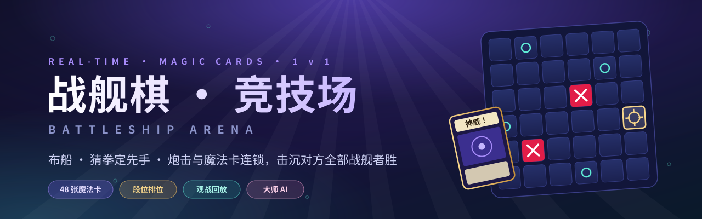

<br>

**经典海战棋 × 48 种魔法卡 × 连锁对决 —— 一款实时双人网页对战游戏**

<p>
  
  
  
  
  
  
</p>

<p>
  <a href="http://8.133.180.159:5000/"><b>🎮 在线试玩</b></a> ·
  <a href="#-快速开始"><b>🚀 本地运行</b></a> ·
  <a href="#-魔法卡"><b>🃏 魔法卡</b></a> ·
  <a href="#-功能一览"><b>✨ 功能</b></a> ·
  <a href="./docs"><b>📚 设计文档</b></a>
</p>

</div>

<br>

<p align="center">
  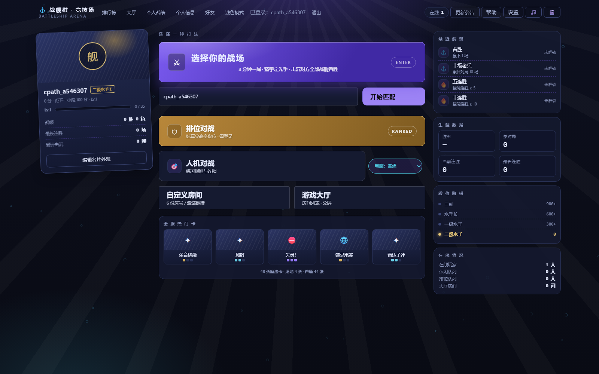
</p>

---

## 🌊 这是什么

在 6×6 的海域里藏好你的 **6 艘战舰**，猜拳决定先手，然后轮流开炮 —— 先击沉对方全部战舰的人获胜。

听起来是小时候的纸笔游戏？再加上 **48 种魔法卡**：冻结敌舰、3×3 区域放逐、整行轰炸、偷看对方手牌、改写全场规则的场地魔法……
对手出牌时，你还可以用速阶 3 的卡**连锁响应**，把局势在一瞬间翻过来。

> [!TIP]
> 不想注册也能以游客身份直接匹配；想冲段位就登录打 **排位对战**。

---

## 📸 游戏画面

<table>
  <tr>
    <td width="50%">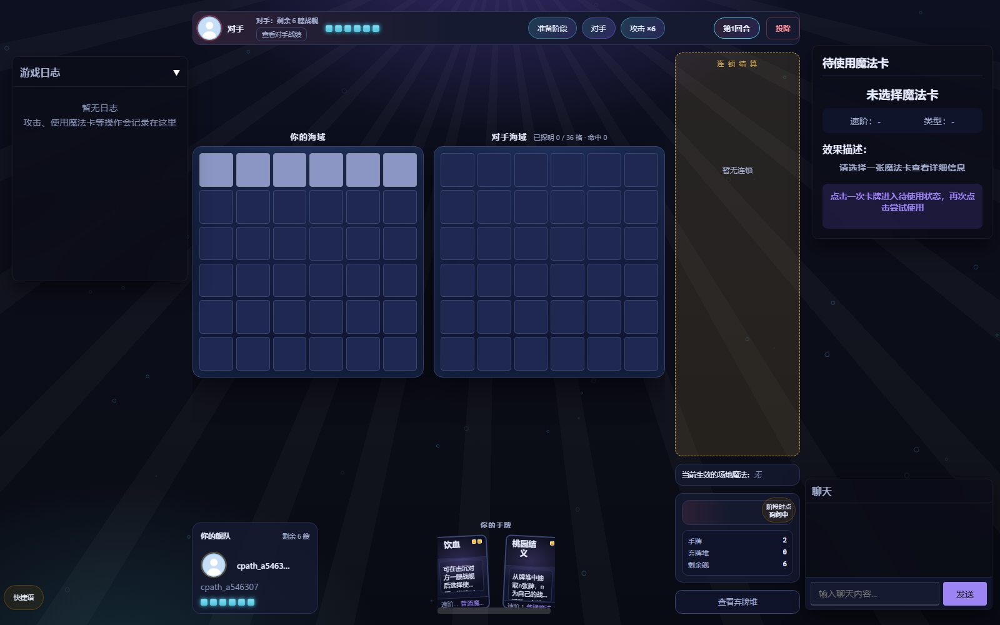<p align="center"><sub><b>对局</b> · 双方海域 / 连锁区 / 手牌 / 聊天</sub></p></td>
    <td width="50%">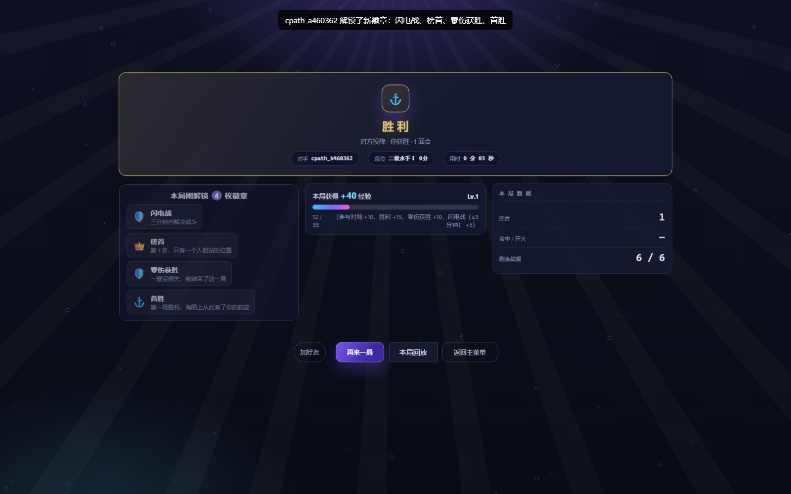<p align="center"><sub><b>结算</b> · 徽章解锁 / 经验 / 本局回放入口</sub></p></td>
  </tr>
  <tr>
    <td>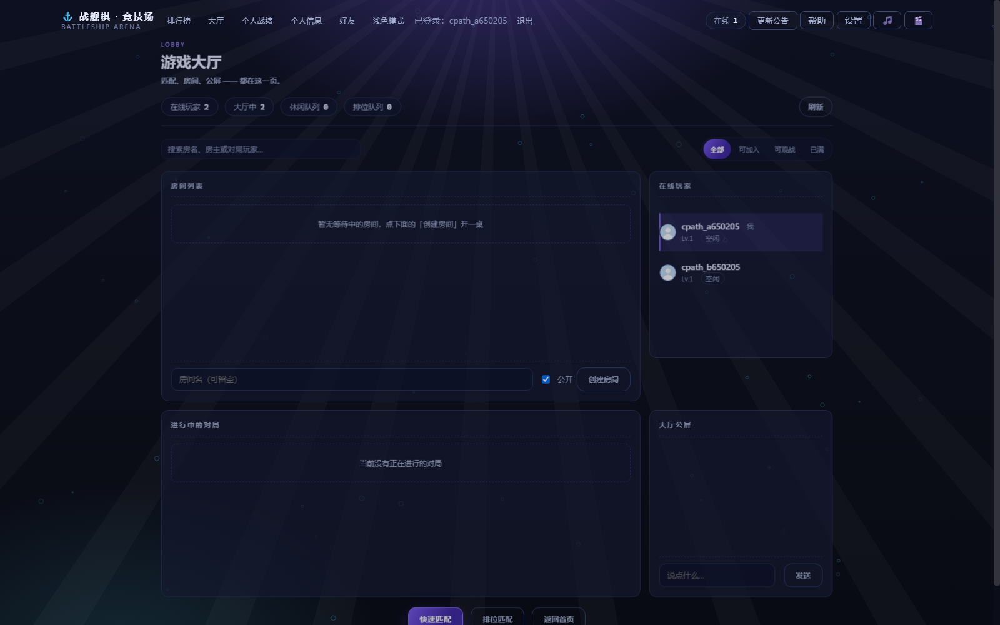<p align="center"><sub><b>游戏大厅</b> · 房间列表 / 在线玩家 / 公屏</sub></p></td>
    <td>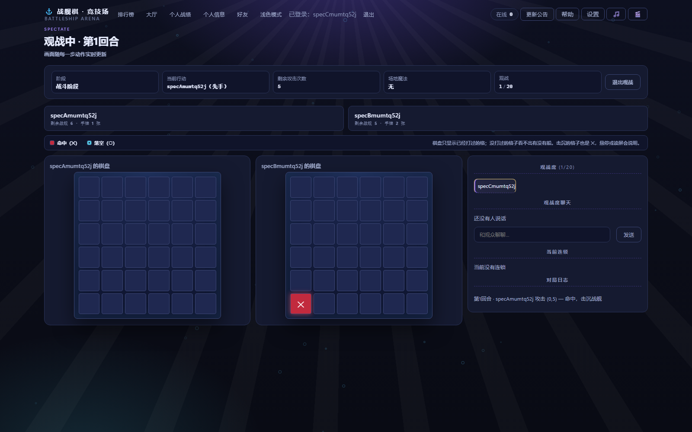<p align="center"><sub><b>实时观战</b> · 只看已打过的格子，绝不泄露船位</sub></p></td>
  </tr>
  <tr>
    <td>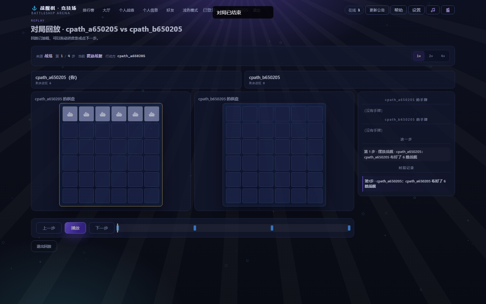<p align="center"><sub><b>对局回放</b> · 逐步回看 / 1×2×4× 倍速 / 关键节点</sub></p></td>
    <td>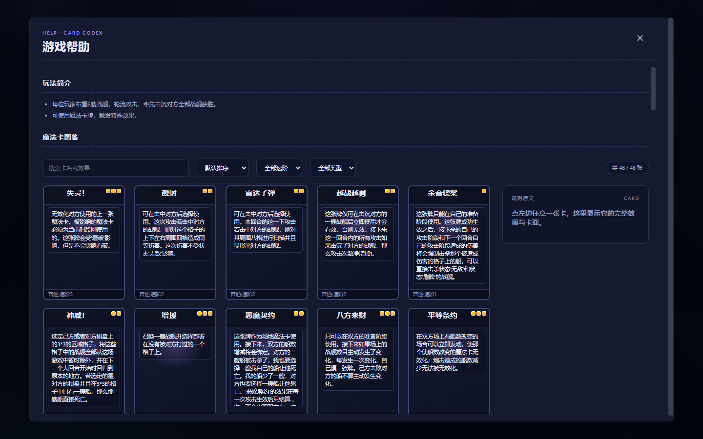<p align="center"><sub><b>卡牌图鉴</b> · 按速阶、类型筛选与全文搜索</sub></p></td>
  </tr>
</table>

---

## 🎯 玩法

```text
  ┌─────────┐    ┌───────────┐    ┌──────────────────────────────────┐    ┌────────┐
  │  布 船  │ ─▶ │ 猜拳定先手 │ ─▶ │ 准备阶段 ─▶ 战斗阶段 ─▶ 结束阶段 │ ─▶ │  胜 负  │
  │ 6 艘单格 │    │ 先手抽1张  │    │   出牌       开炮        交回合   │    │ 全灭即负 │
  └─────────┘    │ 后手抽2张  │    └───────────────▲──────┬──────────┘    └────────┘
                 └───────────┘                    └──────┘ 轮流进行
```

- 通常 **攻击次数 = 存活战舰数 − 被冻结的战舰数**；场地和其他卡牌效果可以改变火力。
- **速阶 1 / 2** 通常在自己回合的准备、战斗阶段打出；「Freezing！」只在满足条件的先手结束阶段发动。**速阶 3** 可以在双方回合使用，包括对方出牌时的**连锁响应**；具体仍受卡牌发动条件和禁牌效果限制。
- 连锁按**后进先出**结算，每次响应窗口 10 秒；「失灵！」「平等条约」能直接无效化栈中下方那张卡。
- **场地魔法**全场同时只能存在一张，后来者顶替前者。
- 回合思考时间默认 90 秒，超时只做保底动作（进入战斗 / 随机开一炮 / 交回合），**不会判负**。

---

## 🃏 魔法卡

<p align="center">
  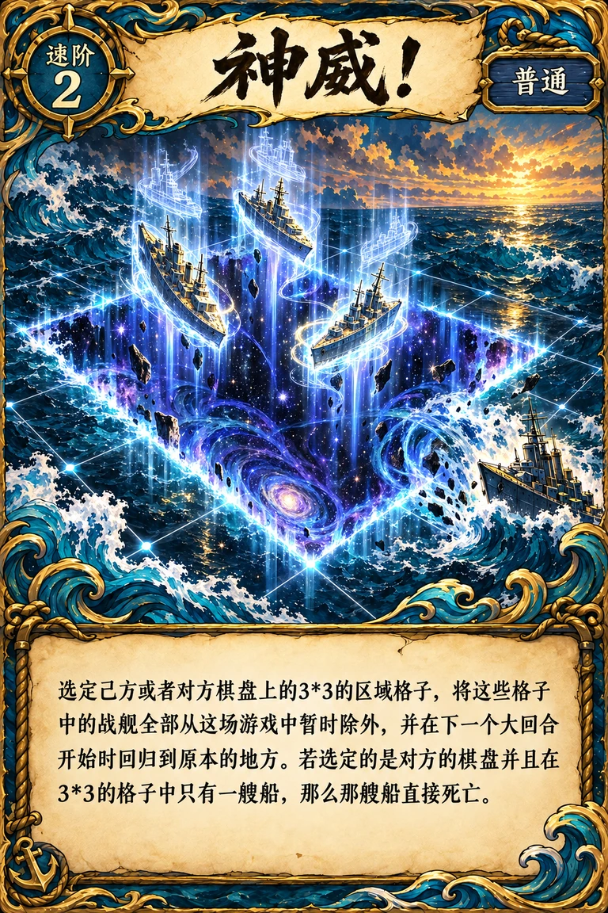
  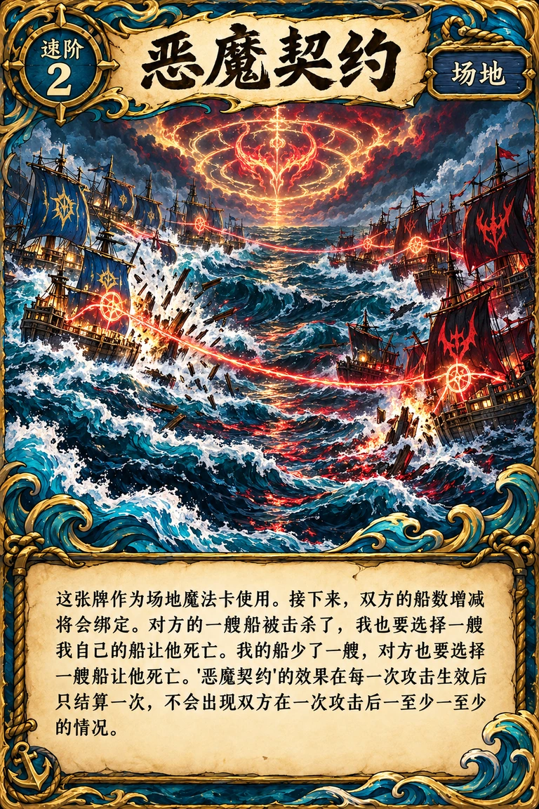
  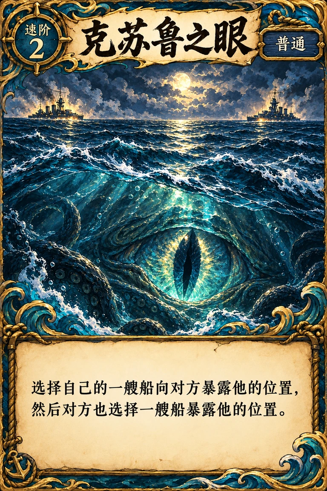
  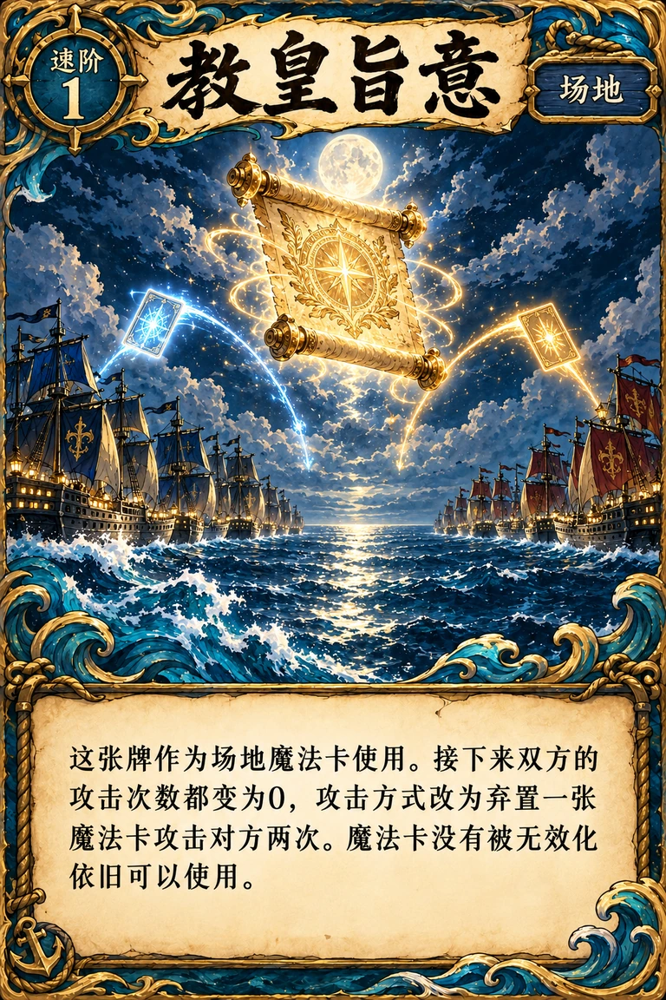
  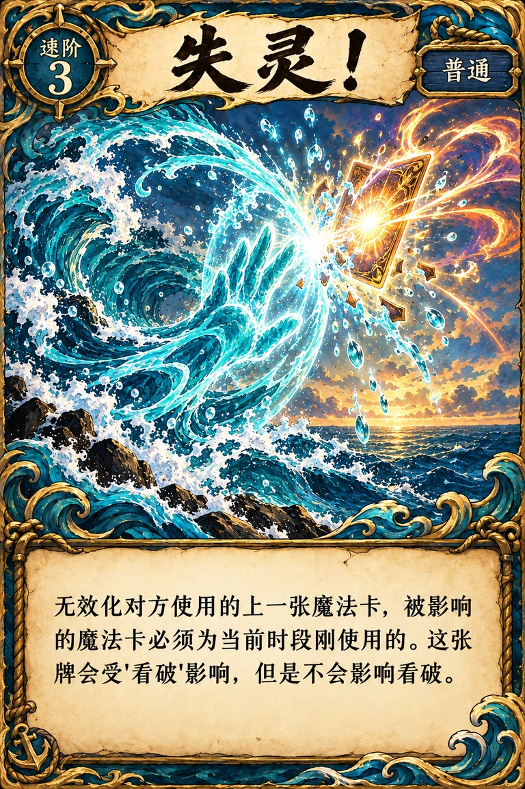
</p>

卡池共 **50 张 / 48 种**（「失灵！」有 3 张），每一张都有独立绘制的完整卡面。

| 类别 | 速阶 | 数量 | 代表卡牌 |
|:--|:--:|:--:|:--|
| ⚔️ 普通 | 1 | 13 | 仁王之盾 · 火力全开 · 桃园结义 · 败者食尘 · 回光返照 |
| ⚔️ 普通 | 2 | 14 | 神威！ · 冻结 · 轰炸 · 探测雷达 · 克苏鲁之眼 · 溅射 |
| ⚡ 普通（可连锁） | 3 | 16 | 失灵！×3 · 平等条约 · 神机妙算 · 绝处逢生 · 加百列之光 |
| 🌀 场地 | 1–2 | 4 | 恶魔契约 · 禁忌果实 · 伊甸园 · 教皇旨意 |
| 🎲 判定 | 1 | 3 | 命运骰子 · 无忧梦呓 · 兵粮寸断 |

<details>
<summary><b>几张值得一提的卡</b></summary>

<br>

| 卡牌 | 效果 |
|:--|:--|
| **神威！** | 选定任一方 3×3 区域，其中战舰暂时离场；若是对方棋盘且只框住一艘船，那艘船直接沉没 |
| **恶魔契约** | 场地：双方船数绑定，我沉一艘你也得沉一艘 |
| **教皇旨意** | 场地：攻击次数归零，改为弃一张魔法卡换两次攻击 |
| **伊甸园** | 场地：每回合攻击次数变为 `6 − 自身战舰数`，越劣势越凶 |
| **禁忌果实** | 场地：除「失灵！」与其他场地卡外，双方都不能出牌 |
| **败者食尘** | 立即重开对局，但双方保留手牌 |
| **绝处逢生** | 自己至少有 3 艘战舰时，牺牲舰队并重部署唯一一艘；之后击沉对方一艘即判胜 |

</details>

---

## ✨ 功能一览

<table>
<tr>
<td width="50%" valign="top">

### ⚔️ 对战
- **休闲匹配 / 排位对战** —— 自动配对
- **人机对战** —— 简单 · 普通 · 困难 · **大师** 四档
- **自定义房间** —— 6 位房号 + 一键复制邀请链接
- **游戏大厅** —— 房间列表、在线玩家、公屏聊天
- **好友** —— 加好友、私聊、邀请对战
- **断线重连** —— 30 秒宽限，整局状态完整恢复

</td>
<td width="50%" valign="top">

### 🏆 成长
- **段位** —— 二级水手 → … → 船长 → **大舰长**，9 段 25 级
- **等级经验** —— 1–100 级，结算有滚动升级动画
- **12 枚成就徽章** —— 首胜、五连胜、零伤获胜、闪电战…
- **名片外观** —— 12 称号 · 10 头像框 · 11 卡背随段位解锁
- **排行榜** —— 战绩榜 + 段位榜，前三名领奖台

</td>
</tr>
<tr>
<td valign="top">

### 👀 观看
- **实时观战** —— 每局最多 20 名观众，独立观战席聊天
- **对局回放** —— 从战绩一键回看，支持倍速与关键节点跳转
- **隐私开关** —— 段位、回放、观战都可以设为不公开

</td>
<td valign="top">

### 🎨 体验
- **C+ 竞技场视觉** —— 深色玻璃拟态，桌面 / 平板 / 手机三档自适应
- **动态壁纸** —— 直接导入 Wallpaper Engine 的视频/图片壁纸
- **音效与 BGM** —— 全部 Web Audio 现场合成，零素材也能响
- **局内快捷语** · **更新公告** · **深浅色主题**

</td>
</tr>
</table>

### 🤖 关于「大师」AI

大师档会**试算每张候选卡的结果再挑最优**、交错出牌、每回合最多打 3 张，并根据已暴露的情报决定开炮位置。
在固定种子、可复现的自对弈中，**大师 vs 困难 = 75.00%**（25 000 局，95% CI 74.46–75.53）。
详细的决策层设计与逐项消融数据见 [`docs/MASTER_AI_2026_09_21.md`](docs/MASTER_AI_2026_09_21.md)。

---

## 🚀 快速开始

> [!IMPORTANT]
> 需要 **Python 3.10+**，所有命令都要在**项目根目录**执行（服务端按相对路径读取卡表）。

```bash
git clone https://github.com/xiaoxiaoyiiii/battle_ship1.0.git
cd battle_ship1.0
python -m venv .venv
source .venv/bin/activate    # Windows PowerShell：.venv\Scripts\Activate.ps1
python -m pip install -r requirements.txt

python server.py             # 启动 Socket.IO 服务，读取 PORT 环境变量
```

打开 <http://localhost:5000>，开两个浏览器窗口就能自己和自己对战，或者直接选人机。

### 运行测试

```bash
python -m pytest tests/ -q
```

截至 2026-10-08，测试结果为 **999 passed**；运行时间随环境变化。
未设置 `BATTLESHIP_DB_PATH` 时，测试会把数据库重定向到临时目录；若已设置该变量，请先取消设置或指向专用测试库，避免写入真实数据。
`tools/` 下另有 80 余个无头浏览器检查脚本（`*.mjs`），覆盖布局、手牌、连锁、观战、回放与跨屏完整路径。

### 环境变量

| 变量 | 默认 | 说明 |
|:--|:--|:--|
| `SECRET_KEY` | 随机 | **生产必设**，否则重启后所有登录失效 |
| `PORT` | `5000` | 监听端口（`python server.py` 时生效） |
| `CORS_ORIGINS` | `http://localhost:5000,http://127.0.0.1:5000` | 允许的来源，多个地址用逗号分隔；使用其他端口或生产域名时须配置对应来源 |
| `BATTLESHIP_DB_PATH` | `data/battleship.db` | SQLite 数据库路径 |
| `TURN_TIMEOUT_SECONDS` | `90` | 回合思考时间，`0` 关闭 |
| `ARENA_SCREENS_MODE` | `v2` | C+ 周边屏幕样式门控；设 `off` 关闭这批样式，不等于回退全部界面源码 |
| `BATTLESHIP_WALLPAPER_ALLOW_REMOTE` | — | 设 `1` 允许非本机访问时扫描壁纸库 |
| `ENABLE_TEST_EVENTS` | — | 仅本地调试 / E2E 用，**生产切勿开启** |

---

## 🧱 架构

```text
 浏览器  index.html + game.js + arena_screens.css
   │  ▲
   │  │  Socket.IO（实时对局 / 大厅 / 观战）      HTTP（账号 / 排行 / 回放 / 公告）
   ▼  │                                                  │
 server.py ── 房间 · 状态机 · 魔法卡结算 · 连锁引擎 ──┐   │
   │            ▲                                     │   ▼
   │            └──── from api import app ───────── api.py (Flask)
   ▼                                                  │
 db.py  ─────────────── SQLite（WAL）◀────────────────┘
```

**核心规则在服务端统一实现**：段位、等级、徽章、名片解锁与观战过滤拆成独立模块；回放模块记录对局并生成时间线。前端读取服务端结果，负责展示和交互。

| 模块 | 职责 |
|:--|:--|
| `server.py` | Socket.IO 事件、房间管理、游戏状态机、魔法卡结算、连锁引擎、人机 |
| `api.py` · `db.py` | HTTP 路由 · 数据访问层（SQLite / WAL） |
| `ai_brain.py` | 大师 AI 决策层（试算 → 评分 → 选择） |
| `ranks.py` · `leveling.py` · `achievements.py` · `profile_spec.py` | 段位 · 等级经验 · 徽章 · 名片外观与解锁 |
| `spectate.py` · `replay.py` | 观战事件白名单与净化 · 对局回放时间线 |
| `anticheat.py` · `suspicion.py` · `match_guard.py` | 反作弊判据 · 嫌疑度 · 匹配规避 |
| `presence.py` · `dm.py` · `quick_chat.py` · `changelog.py` | 在线状态 · 好友私聊 · 快捷语 · 更新公告 |
| `wallpaper.py` | Wallpaper Engine 壁纸扫描与媒体服务 |
| `static/` · `templates/` | 原生 JS 单页前端、样式、卡面、音效 |

---

## 🔐 安全设计

- 密码使用 Werkzeug 加盐哈希；登录 / 注册 / 改密带 IP 限流；头像上传限 2 MB 并校验文件魔数。
- 所有对局操作都在服务端做**身份 + 连接双重校验**，客户端上报的任何数据都不被信任。
- 观战者只进入独立的观战频道，下发的每一帧都经过**白名单净化**，看不到任何未暴露的船位。
- 排位结算接入实时反作弊判据，赛前投降、人机局、自定义房不计分。
- 壁纸扫描与本机路径导入**仅限回环地址**访问。

---

## 📚 延伸阅读

| 文档 | 内容 |
|:--|:--|
| [`CLAUDE.md`](CLAUDE.md) | 面向开发者 / AI 代理的代码索引与踩坑记录 |
| [`docs/CHAIN_ENGINE_SPEC.md`](docs/CHAIN_ENGINE_SPEC.md) | 连锁引擎规格 |
| [`docs/RANKED_2026_09_17.md`](docs/RANKED_2026_09_17.md) | 段位与排位系统 |
| [`docs/MASTER_AI_2026_09_21.md`](docs/MASTER_AI_2026_09_21.md) | 大师 AI 设计与度量 |
| [`docs/SPECTATE_2026_09_22.md`](docs/SPECTATE_2026_09_22.md) · [`docs/REPLAY_2026_09_23.md`](docs/REPLAY_2026_09_23.md) | 观战与回放 |
| [`docs/WALLPAPER_ENGINE.md`](docs/WALLPAPER_ENGINE.md) | 动态壁纸实现与安全模型 |
| [`docs/DEPLOYMENT.md`](docs/DEPLOYMENT.md) | 部署说明 |

---

<div align="center">

<sub>个人学习 / 娱乐项目 · 卡牌名称与效果灵感来自各类卡牌游戏，仅供交流学习</sub>

<sub>⚓ 祝你炮炮命中</sub>

</div>
